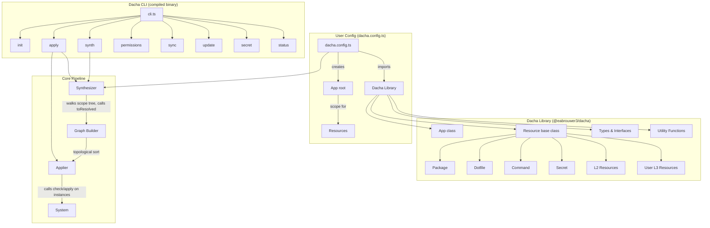
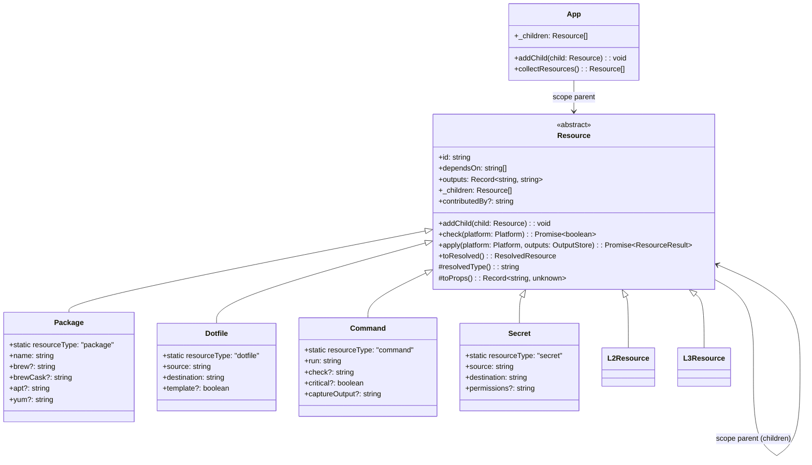

# Design Document: dacha-v2-redesign

## Overview

Dacha v2 redesigns the core resource model from plain object literals with separate executor objects into a CDK-style class-based architecture with a construct-tree scope pattern. Each resource class embeds its own `check()` and `apply()` logic. Resources are organized into a scope tree rooted at an `App` instance — child resources register themselves with their parent scope via the constructor. The library is published to GitHub Packages so users import typed resource classes directly in their `dacha.config.ts`. The default clone path moves from `~/.dotfiles` to `~/.dacha/`, and a permission management system handles Deno permission prompting on first run with persistence for background daemons.

The redesign is greenfield — no backward compatibility or migration concerns. The existing applier, dependency graph, profile system, and CLI structure are preserved and adapted to work with class instances and the scope tree instead of plain objects.

### Key Design Decisions

1. **Abstract `Resource` base class** replaces the `Resource` interface + `ResourceExecutor` pattern. Each resource type (Package, Dotfile, Command, Secret) becomes a concrete class with `check()` and `apply()` methods baked in. This eliminates the executor dispatch in `apply.ts` and makes custom resources (L2/L3) natural via subclassing.

2. **CDK-style scope pattern for composition** — every Resource constructor takes `(scope, id, props)`. The scope is the parent (another Resource or the App root). Children auto-register with their parent on construction. The synthesizer walks the tree from the App root to collect all leaf resources. No `resources()` override method needed.

3. **App root scope** — a top-level `App` class serves as the root of the scope tree. The user's `dacha.config.ts` creates an App, constructs resources with it as scope, and returns the App.

4. **No `type` field on Resource classes** — type discrimination uses `instanceof` instead of a string discriminator. The `ResolvedResource` type still carries a type string for serialization, derived from a static field or the class name.

5. **Platform filtering is user-land logic** — resources do not have an `onlyOn` property. Users handle platform-specific resources with `if` statements in their `dacha.config.ts` using the platform context.

6. **Dual distribution** — the same codebase produces both the npm library package (via `deno.json` exports) and compiled CLI binaries (via `deno compile`). The release workflow gains a publish step alongside the existing compile matrix.

7. **Permission store** — a JSON file at `~/.config/dacha/permissions.json` records granted Deno permissions. The CLI checks this on startup and skips prompts for already-granted permissions. Daemon launchers pass explicit flags derived from the store.

## Architecture



### Pipeline Flow

1. User writes `dacha.config.ts` importing resource classes from `@eabrouwer3/dacha`
2. User creates an `App` instance, constructs resources with the App (or other resources) as scope, and returns the App
3. `synth` receives the App and walks the scope tree to collect all leaf resources
4. Each leaf instance's `toResolved()` produces a `ResolvedResource` for the graph builder
5. `buildGraph()` (unchanged) builds the DAG and topological sort
6. `apply()` iterates sorted resources, calling `check()` and `apply()` directly on class instances instead of dispatching to separate executors

### Key Architectural Change: Executor Elimination

Current pattern (v1):
```
Resource (plain object) → getExecutor(type) → PackageExecutor.check() / .apply()
```

New pattern (v2):
```
Resource (class instance) → resource.check() / resource.apply()
```

The `getExecutor()` dispatch in `apply.ts` is removed. The applier calls methods directly on the resource instance. The existing check/apply logic from `PackageExecutor`, `DotfileExecutor`, `CommandExecutor`, and `SecretExecutor` moves into the corresponding class methods.

## Components and Interfaces

### App Class

```typescript
// src/app.ts

import type { Resource } from "./resource.ts";

export class App {
  readonly _children: Resource[] = [];

  /** Called by Resource constructors to register themselves. */
  addChild(child: Resource): void {
    this._children.push(child);
  }

  /** Recursively collect all leaf resources from the scope tree. */
  collectResources(): Resource[] {
    const leaves: Resource[] = [];
    function walk(children: Resource[]): void {
      for (const child of children) {
        if (child._children.length === 0) {
          leaves.push(child);
        } else {
          walk(child._children);
        }
      }
    }
    walk(this._children);
    return leaves;
  }
}
```

### Resource Base Class

```typescript
// src/resource.ts

import type { App } from "./app.ts";
import type { OutputStore, Platform, ResolvedResource, ResourceResult } from "./types.ts";

export abstract class Resource {
  readonly id: string;
  readonly dependsOn: string[];
  readonly outputs: Record<string, string> = {};
  readonly _children: Resource[] = [];
  contributedBy?: string;

  constructor(scope: Resource | App, id: string, props?: { dependsOn?: string[] }) {
    this.id = id;
    this.dependsOn = props?.dependsOn ?? [];
    scope.addChild(this);
  }

  /** Called by child Resource constructors to register themselves. */
  addChild(child: Resource): void {
    this._children.push(child);
  }

  /** Check whether this resource is already in the desired state. */
  abstract check(platform: Platform): Promise<boolean>;

  /** Converge this resource to the desired state. */
  abstract apply(platform: Platform, outputs: OutputStore): Promise<ResourceResult>;

  /** Serialize to ResolvedResource for the synthesizer/applier pipeline. */
  toResolved(): ResolvedResource {
    const { id, dependsOn, contributedBy, ...rest } = this.toProps();
    return {
      id,
      type: this.resolvedType(),
      action: rest as Record<string, unknown>,
      dependsOn: dependsOn ?? [],
      contributedBy: contributedBy ?? "unknown",
    };
  }

  /** Return the type string for serialization. Subclasses override via a static field or this method. */
  protected resolvedType(): string {
    return (this.constructor as { resourceType?: string }).resourceType ?? this.constructor.name.toLowerCase();
  }

  /** Return the plain-object representation of this resource's config. Subclasses override. */
  protected abstract toProps(): Record<string, unknown> & { id: string };
}
```

### L1 Resource Classes

```typescript
// src/resources/package.ts

import { Resource } from "../resource.ts";
import type { App } from "../app.ts";
import type { OutputStore, Platform, ResourceResult } from "../types.ts";

export interface PackageProps {
  name: string;
  brew?: string;
  brewCask?: string;
  apt?: string;
  yum?: string;
  dependsOn?: string[];
}

export class Package extends Resource {
  static readonly resourceType = "package";

  readonly name: string;
  readonly brew?: string;
  readonly brewCask?: string;
  readonly apt?: string;
  readonly yum?: string;

  constructor(scope: Resource | App, id: string, props: PackageProps) {
    super(scope, id, props);
    this.name = props.name;
    this.brew = props.brew;
    this.brewCask = props.brewCask;
    this.apt = props.apt;
    this.yum = props.yum;
  }

  /** Module-level flag — once brew is confirmed/installed, skip future checks. */
  private static _brewVerified = false;

  /**
   * Ensure the package manager binary exists before running install commands.
   * - brew: auto-install via the official Homebrew install script if missing.
   * - apt/dnf/yum: throw a clear error if the binary is not found (system
   *   package managers cannot be auto-installed).
   * Uses a module-level flag so the brew check is a one-time operation.
   */
  private async ensurePackageManager(platform: Platform): Promise<void> {
    const pm = platform.packageManager;

    if (pm === "brew") {
      if (Package._brewVerified) return;
      const result = await exec("command -v brew");
      if (result.code !== 0) {
        info("Homebrew not found — installing via official script…");
        const install = await exec(
          '/bin/bash -c "$(curl -fsSL https://raw.githubusercontent.com/Homebrew/install/HEAD/install.sh)"',
        );
        if (install.code !== 0) {
          throw new Error(
            `Failed to auto-install Homebrew: ${install.stderr.trim() || `exit code ${install.code}`}`,
          );
        }
      }
      Package._brewVerified = true;
      return;
    }

    // apt, dnf, yum — cannot auto-install; verify binary exists
    const result = await exec(`command -v ${pm}`);
    if (result.code !== 0) {
      throw new Error(
        `System package manager "${pm}" is not installed and cannot be auto-installed. ` +
        `Please install ${pm} manually before running dacha.`,
      );
    }
  }

  // check() and apply() contain the logic currently in PackageExecutor
  async check(platform: Platform): Promise<boolean> { /* ... */ }
  async apply(platform: Platform, outputs: OutputStore): Promise<ResourceResult> {
    await this.ensurePackageManager(platform);
    /* ... existing install logic ... */
  }

  protected toProps() {
    return {
      id: this.id, name: this.name,
      brew: this.brew, brewCask: this.brewCask, apt: this.apt, yum: this.yum,
      dependsOn: this.dependsOn,
    };
  }
}
```

The same pattern applies to `Dotfile`, `Command`, and `Secret` classes — each moves the executor logic into class methods and exposes a typed `(scope, id, props)` constructor.

```typescript
// src/resources/command.ts (signature)

export interface CommandProps {
  run: string;
  check?: string;
  critical?: boolean;
  captureOutput?: string;
  dependsOn?: string[];
}

export class Command extends Resource {
  static readonly resourceType = "command";
  constructor(scope: Resource | App, id: string, props: CommandProps) { /* ... */ }
}
```

```typescript
// src/resources/dotfile.ts (signature)

export interface DotfileProps {
  source: string;
  destination: string;
  template?: boolean;
  dependsOn?: string[];
}

export class Dotfile extends Resource {
  static readonly resourceType = "dotfile";
  constructor(scope: Resource | App, id: string, props: DotfileProps) { /* ... */ }
}
```

```typescript
// src/resources/secret.ts (signature)

export interface SecretProps {
  source: string;
  destination: string;
  permissions?: string;
  dependsOn?: string[];
}

export class Secret extends Resource {
  static readonly resourceType = "secret";
  constructor(scope: Resource | App, id: string, props: SecretProps) { /* ... */ }
}
```

### Composite Resource Example (L2/L3)

```typescript
// User-defined L3 resource in dacha.config.ts
import { App, Package, Command, Resource } from "@eabrouwer3/dacha";

class RustToolchain extends Resource {
  constructor(scope: Resource | App, id: string) {
    super(scope, id);
    new Command(this, "install", {
      run: "curl --proto '=https' --tlsv1.2 -sSf https://sh.rustup.rs | sh -s -- -y",
      check: "command -v rustc",
      critical: true,
    });
    new Package(this, "cargo-edit", {
      name: "cargo-edit",
      dependsOn: [`${this.id}-install`],
    });
  }

  async check(): Promise<boolean> { return false; }
  async apply(): Promise<ResourceResult> { return { status: "skipped" }; }
  protected toProps() { return { id: this.id }; }
}
```

### User Config Example

```typescript
// dacha.config.ts
import { App, Package, Dotfile, Command } from "@eabrouwer3/dacha";

export default (ctx) => {
  const app = new App();

  new Package(app, "git", { name: "git" });
  new Package(app, "curl", { name: "curl" });

  if (ctx.platform.os === "darwin") {
    new Package(app, "coreutils", { name: "coreutils" });
  }

  new Dotfile(app, "gitconfig", {
    source: "./config/gitconfig",
    destination: "~/.gitconfig",
  });

  return app;
};
```

### Synthesizer Changes

The synthesizer walks the App's scope tree instead of flattening via `resources()`:

```typescript
// Updated src/synth.ts

import type { App } from "./app.ts";
import type { Resource } from "./resource.ts";

/**
 * Walk the scope tree from the App root and collect all leaf resources.
 * Leaf resources are those with no children.
 * Child resources inherit parent dependencies.
 */
function collectFromTree(app: App): Resource[] {
  const leaves: Resource[] = [];

  function walk(children: Resource[], parentDeps: string[]): void {
    for (const child of children) {
      // Inherit parent dependencies
      for (const dep of parentDeps) {
        if (!child.dependsOn.includes(dep)) {
          child.dependsOn.push(dep);
        }
      }

      if (child._children.length === 0) {
        leaves.push(child);
      } else {
        walk(child._children, child.dependsOn);
      }
    }
  }

  walk(app._children, []);
  return leaves;
}
```

The existing `buildGraph()`, cycle detection, and Kahn's algorithm remain unchanged — they operate on the collected leaf resource list.

The synthesizer no longer performs platform filtering on resources. Platform-conditional logic is handled by the user in their `dacha.config.ts` via `if` statements on the platform context.

### Applier Changes

The applier simplifies by calling methods directly on resource instances:

```typescript
// In apply.ts — the getExecutor() dispatch is removed
// Instead of:
//   const executor = getExecutor(resolved.type);
//   await executor.check(resource, state.platform);
// Now:
//   await resource.check(state.platform);
//   await resource.apply(state.platform, outputs);
```

The applier receives `Resource[]` (class instances) alongside the topological order, rather than reconstructing typed resources from `ResolvedResource`.

### Permission Management

```typescript
// src/permissions.ts

export interface PermissionStore {
  granted: PermissionEntry[];
  deniedAt?: string;
}

export interface PermissionEntry {
  name: string;       // "read" | "write" | "env" | "net" | "run" | "sys"
  grantedAt: string;  // ISO timestamp
}

const STORE_PATH = "~/.config/dacha/permissions.json";
const REQUIRED_PERMISSIONS = ["read", "write", "env", "net", "run", "sys"] as const;

/** Load the permission store, returning empty if not found. */
export async function loadPermissions(): Promise<PermissionStore> { /* ... */ }

/** Save the permission store. */
export async function savePermissions(store: PermissionStore): Promise<void> { /* ... */ }

/** Prompt for missing permissions, record grants, return final state. */
export async function ensurePermissions(): Promise<PermissionStore> { /* ... */ }

/** Delete the permission store to force re-prompting. */
export async function resetPermissions(): Promise<void> { /* ... */ }

/** Format the store for display (dacha permissions show). */
export function formatPermissions(store: PermissionStore): string { /* ... */ }
```

### Library Entry Point (mod.ts)

```typescript
// src/mod.ts — updated exports

// App root scope
export { App } from "./app.ts";

// Resource classes
export { Resource } from "./resource.ts";
export { Package } from "./resources/package.ts";
export { Dotfile } from "./resources/dotfile.ts";
export { Command } from "./resources/command.ts";
export { Secret } from "./resources/secret.ts";

// Types
export type {
  DachaConfig, OutputStore, Params, Paths, Platform,
  PlatformFilter, Profile, ResolvedResource, ResolvedState,
  ResourceResult,
} from "./types.ts";

// Utility functions
export { synth } from "./synth.ts";
export { apply } from "./apply.ts";
export { resolveProfile } from "./profile.ts";
export { buildGraph } from "./graph.ts";
export { detectPlatform } from "./platform.ts";
```


### Package Publishing (deno.json)

```json
{
  "name": "@eabrouwer3/dacha",
  "version": "2.0.0",
  "exports": {
    ".": "./src/mod.ts"
  },
  "imports": { /* existing imports */ },
  "tasks": { /* existing tasks */ },
  "compilerOptions": { "strict": true }
}
```

### Release Workflow Addition

The release workflow gains a `publish` job after the existing `build` + `release` jobs:

```yaml
  publish:
    needs: release
    runs-on: ubuntu-latest
    permissions:
      contents: read
      packages: write
    steps:
      - uses: actions/checkout@v4
      - uses: denoland/setup-deno@v2
        with:
          deno-version: v2.x
      - name: Publish to GitHub Packages
        run: deno publish --allow-dirty
        env:
          DENO_AUTH_TOKENS: ${{ secrets.GITHUB_TOKEN }}@ghcr.io
```

### CLI Changes

New subcommands added to `cli.ts`:

```
dacha permissions show    — display granted permissions from the store
dacha permissions reset   — delete the permission store, force re-prompting
```

The `init` command default path changes from `~/.dotfiles` to `~/.dacha/`:

```typescript
function defaultRepoPath(): string {
  const home = Deno.env.get("HOME") ?? "~";
  return join(home, ".dacha");  // was: join(home, ".dotfiles")
}
```

Compile tasks change from `--allow-all` to granular permissions:

```json
"compile": "deno compile --allow-read --allow-write --allow-env --allow-net --allow-run --allow-sys --output dacha src/cli.ts"
```

## Data Models

### Resource Class Hierarchy



### Updated Type Definitions

The `Resource` interface in `types.ts` is replaced by the abstract class. The following types remain as interfaces:

```typescript
// types.ts — preserved interfaces (unchanged from v1)

export interface Platform {
  os: "darwin" | "linux";
  arch: "arm64" | "x64";
  distro?: string;
  packageManager: PackageManagerType;
}

export type PackageManagerType = "brew" | "apt" | "yum" | "dnf";

export interface PlatformFilter {
  os?: Platform["os"];
  arch?: Platform["arch"];
  distro?: string;
}

export interface DachaConfig {
  repoPath: string;
  target: Profile;
  params?: ParamDefinition[];
  sync?: { enabled: boolean; debounceMs?: number };
  update?: { enabled: boolean; intervalHours?: number };
}

// ResolvedResource, ResolvedState, ResourceResult, OutputStore — unchanged
```

Note: `PlatformFilter` is retained as a utility type for general use but is not referenced by any resource class props.

### Permission Store Schema

```typescript
// ~/.config/dacha/permissions.json
{
  "granted": [
    { "name": "read", "grantedAt": "2025-01-15T10:30:00Z" },
    { "name": "write", "grantedAt": "2025-01-15T10:30:00Z" },
    { "name": "env", "grantedAt": "2025-01-15T10:30:00Z" },
    { "name": "net", "grantedAt": "2025-01-15T10:30:00Z" },
    { "name": "run", "grantedAt": "2025-01-15T10:30:00Z" },
    { "name": "sys", "grantedAt": "2025-01-15T10:30:00Z" }
  ]
}
```

### Global Config Schema (unchanged path, updated default)

```typescript
// ~/.config/dacha/config.json
{
  "repoPath": "~/.dacha/"  // was ~/.dotfiles
}
```

## Correctness Properties

*A property is a characteristic or behavior that should hold true across all valid executions of a system — essentially, a formal statement about what the system should do. Properties serve as the bridge between human-readable specifications and machine-verifiable correctness guarantees.*

### Property 1: Resource constructor round-trip

*For any* L1 Resource type (Package, Dotfile, Command, Secret), any valid props object for that type, and a dummy App scope, constructing the resource with `new Type(app, id, props)` and reading back its fields should yield values identical to the input props. The instance must also have a callable `check` method, a callable `apply` method, an `id` string, a `dependsOn` array, and an `outputs` record. The instance must be registered as a child of the scope.

**Validates: Requirements 1.1, 1.2, 1.4, 1.5, 1.7, 2.1, 2.2, 2.3, 2.4**

### Property 2: toResolved serialization preserves identity

*For any* Resource class instance (L1 or composite) constructed with a scope and id, calling `toResolved()` should produce a `ResolvedResource` whose `id` equals the instance's `id`, whose `type` is a non-empty string derived from the class, and whose `dependsOn` array equals the instance's `dependsOn`. The `action` record should contain the resource-specific configuration fields (e.g., `name` for Package, `source`/`destination` for Dotfile).

**Validates: Requirements 1.6, 9.3**

### Property 3: Scope tree collection completeness

*For any* scope tree of Resource instances (where composite resources have children registered via the scope pattern, nested to arbitrary depth), collecting leaf resources from the App root should return every leaf node in the tree exactly once. A leaf is a resource with no children. The count of collected resources should equal the total count of leaf nodes in the tree.

**Validates: Requirements 3.2, 3.3, 4.3, 9.1, 9.2**

### Property 4: Child resources inherit parent dependencies

*For any* composite Resource with a non-empty `dependsOn` list and any child resources registered via the scope pattern, after the synthesizer walks the tree, every leaf child resource's `dependsOn` should be a superset of the parent's `dependsOn`. That is, every dependency of the parent appears in each descendant leaf's dependency list.

**Validates: Requirements 3.4**

### Property 5: Init config path round-trip

*For any* valid filesystem path string provided as the `--path` argument to `dacha init`, the global config file written by init should contain a `repoPath` value equal to that path. Reading the config back and extracting `repoPath` should return the original path.

**Validates: Requirements 7.2, 7.3**

### Property 6: Permission store round-trip and reset

*For any* set of permission names (drawn from "read", "write", "env", "net", "run", "sys"), saving them to the Permission_Store and loading the store back should yield the same set of granted permission names. After calling `resetPermissions()`, loading the store should return an empty granted list (or file-not-found).

**Validates: Requirements 8.3, 8.7**

### Property 7: Permission formatting completeness

*For any* PermissionStore containing a set of granted permissions, the output of `formatPermissions()` should contain every granted permission name as a substring. No granted permission should be omitted from the formatted output.

**Validates: Requirements 8.8**

### Property 8: Scope auto-registration

*For any* App instance and any sequence of Resource constructions using that App (or child resources) as scope, the App's children list should contain exactly the resources constructed with the App as scope, and each child resource's children list should contain exactly the resources constructed with that child as scope. No resource should appear in multiple parents' children lists.

**Validates: Requirements 1.1, 1.2, 1.3, 4.2**

### Property 9: Package manager auto-bootstrap guard

*For any* Platform with `packageManager` set to `"apt"`, `"dnf"`, or `"yum"` where the corresponding binary is not found, calling `ensurePackageManager()` should throw an error whose message contains the package manager name and indicates it cannot be auto-installed. For a Platform with `packageManager` set to `"brew"` where the brew binary is not found, `ensurePackageManager()` should attempt the official Homebrew install script. After a successful brew install (or if brew was already present), subsequent calls should skip the check (module-level flag).

**Validates: Requirements 2.6, 2.7, 2.8**

## Error Handling

### Resource check/apply Errors

- If `resource.check()` throws, the applier logs the error, marks the resource as failed, adds it to `failedIds`, and continues to the next resource. Transitive dependents are skipped (existing behavior preserved).
- If `resource.apply()` returns `{ status: "failed" }`, the applier records the error. If the resource is a `Command` with `critical: true`, the entire apply halts (existing behavior preserved).
- If `resource.apply()` throws, the applier catches the error, records it, and halts (existing behavior preserved).

### Synthesizer Errors

- If `toResolved()` throws on a resource instance, the synthesizer should propagate the error with the resource id for debugging.
- If the scope tree contains cycles (a resource somehow registered as its own ancestor), the existing cycle detection in `buildGraph()` catches it since the collected list would contain duplicate ids forming a cycle.
- If a dynamically imported `dacha.config.ts` throws during evaluation, the error propagates with the config path for context (existing behavior).

### Permission Errors

- If the Permission_Store file is corrupted (invalid JSON), `loadPermissions()` returns an empty store and logs a warning. The user is re-prompted.
- If `Deno.permissions.request()` is unavailable (e.g., running in a compiled binary without prompt support), the CLI catches the error and logs which permissions are missing, continuing with reduced capability per Requirement 8.6.
- If the Permission_Store directory doesn't exist, `savePermissions()` creates it recursively (matching the existing pattern in `writeGlobalConfig()`).

### Init Errors

- If `git clone` fails, the error is logged with the URL and the function throws (existing behavior).
- If the target path already exists as a file (not a directory), `dirExists()` returns false and clone proceeds, which will fail with a git error. This is acceptable — git's error message is clear.

## Testing Strategy

### Dual Testing Approach

Tests use Deno's built-in test runner (`deno test`) with `@std/assert` for assertions and `fast-check` for property-based testing. Both are already dependencies in `deno.json`.

### Unit Tests

Unit tests cover specific examples, edge cases, and error conditions:

- **Resource classes**: Construct each L1 class with `(app, id, props)`, verify fields. Test edge cases like missing optional fields, empty dependsOn.
- **Scope auto-registration**: Construct resources with App and child scopes, verify children lists.
- **toResolved()**: Verify output structure for each L1 type with known inputs.
- **Scope tree collection**: Test with known tree structures — single resource, two-level composite, three-level nesting, empty children.
- **App.collectResources()**: Test with known trees, verify leaf collection.
- **Permission store**: Test load/save with known JSON, test corrupted file handling, test reset deletes file.
- **Init default path**: Verify `defaultRepoPath()` returns `~/.dacha/`.
- **CLI subcommands**: Verify `permissions show` and `permissions reset` subcommands exist.
- **Module exports**: Verify `mod.ts` exports all required classes (including App) and types.
- **deno.json exports field**: Verify the exports field maps to `src/mod.ts`.

### Property-Based Tests

Each correctness property is implemented as a single property-based test using `fast-check` with a minimum of 100 iterations. Each test is tagged with a comment referencing its design property.

- **Property 1 test**: Generate random props for each L1 type (random strings for id/name/source/destination, random boolean for template/critical, random subsets for dependsOn). Construct the class with a fresh App as scope, verify all fields match and the resource is registered as a child.
  - Tag: `Feature: dacha-v2-redesign, Property 1: Resource constructor round-trip`

- **Property 2 test**: Generate random Resource instances with a fresh App scope, call `toResolved()`, verify id/type/dependsOn match and action contains expected keys.
  - Tag: `Feature: dacha-v2-redesign, Property 2: toResolved serialization preserves identity`

- **Property 3 test**: Generate random scope trees (using an arbitrary that produces composite resources with random depth 1–4 and random children counts 0–5, all rooted at an App). Collect leaves and verify total count equals tree leaf count, and every leaf id appears exactly once.
  - Tag: `Feature: dacha-v2-redesign, Property 3: Scope tree collection completeness`

- **Property 4 test**: Generate random composite resources with random dependsOn lists and random children via scope pattern. After tree walking, verify every leaf's dependsOn is a superset of its ancestor's.
  - Tag: `Feature: dacha-v2-redesign, Property 4: Child resources inherit parent dependencies`

- **Property 5 test**: Generate random path strings (valid filesystem paths). Call the config-writing function with the path, read back the JSON, verify `repoPath` matches.
  - Tag: `Feature: dacha-v2-redesign, Property 5: Init config path round-trip`

- **Property 6 test**: Generate random subsets of permission names. Save to a temp file, load back, verify the set matches. Then reset, load again, verify empty.
  - Tag: `Feature: dacha-v2-redesign, Property 6: Permission store round-trip and reset`

- **Property 7 test**: Generate random PermissionStore objects with random subsets of granted permissions. Call `formatPermissions()`, verify every granted permission name appears in the output string.
  - Tag: `Feature: dacha-v2-redesign, Property 7: Permission formatting completeness`

- **Property 8 test**: Generate random sequences of resource constructions with varying scope parents (App and child resources). Verify each parent's children list contains exactly the resources constructed with it as scope, and no resource appears in multiple parents' children lists.
  - Tag: `Feature: dacha-v2-redesign, Property 8: Scope auto-registration`

- **Property 9 test**: For each non-brew package manager ("apt", "dnf", "yum"), stub `exec` to return a non-zero code for `command -v <pm>` and verify `ensurePackageManager()` throws an error containing the package manager name. For "brew", stub `exec` to return non-zero for `command -v brew` and zero for the install script, verify the install script is invoked. Verify the module-level flag skips subsequent checks.
  - Tag: `Feature: dacha-v2-redesign, Property 9: Package manager auto-bootstrap guard`

### Test File Organization

Following the existing pattern (`*.test.ts` alongside source files):

- `src/resource.test.ts` — Properties 1, 2, 8 (base class, toResolved, scope auto-registration)
- `src/resources/package.test.ts` — Property 9 (package manager auto-bootstrap guard)
- `src/synth.test.ts` — Properties 3, 4 (scope tree collection, dependency inheritance) — added to existing test file
- `src/init.test.ts` — Property 5 (config path round-trip)
- `src/permissions.test.ts` — Properties 6, 7 (permission store and formatting)

### Test Configuration

- Property tests: minimum 100 iterations via `fc.assert(fc.property(...), { numRuns: 100 })`
- All tests run via `deno task test` (existing task, no changes needed)
- Tests use `@std/assert` for assertions and `fast-check` (already in `deno.json` imports)
